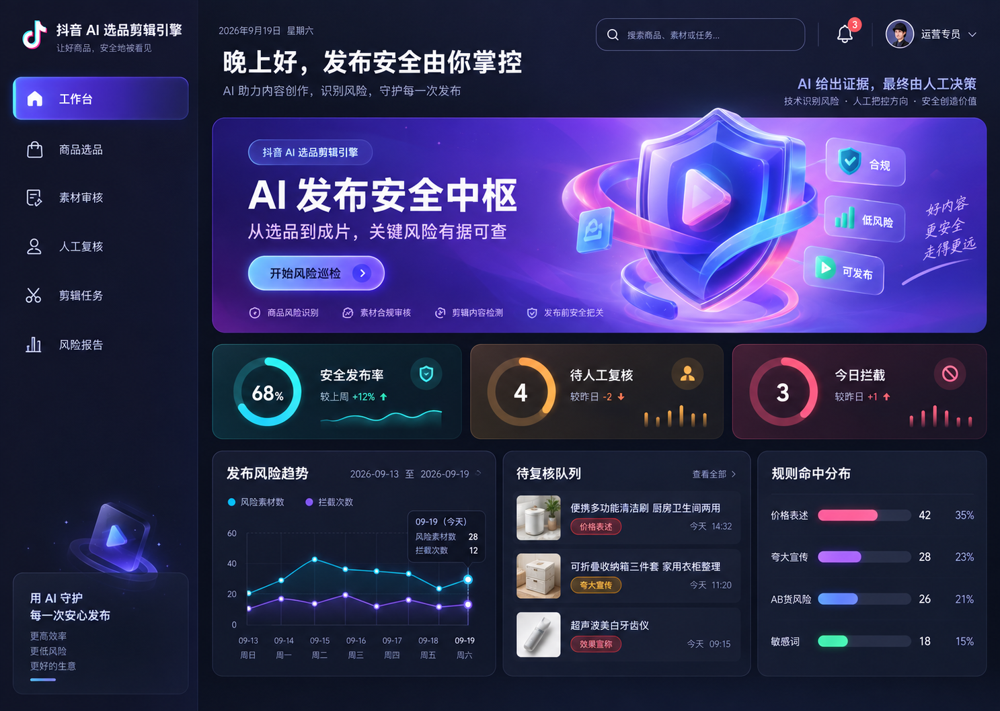

<div align="center">

# GuardFlow · AI 短视频电商发布安全中枢

**把选品、素材合规、人工复核、智能剪辑和风险报告串成一条可解释的发布链路。**

[](https://www.python.org/)
[](https://flask.palletsprojects.com/)
[](https://sqlite.org/)
[](#测试)
[](LICENSE)

</div>



## 为什么做这个项目

短视频电商工具往往只解决“找商品”或“批量剪视频”，但真正进入发布环节时，团队还要面对夸大功效、极限词、价格表达、水印、AB 货等风险。GuardFlow 将增长判断和合规判断放进同一条工作流：

```text
候选商品 → 可解释评分 → 素材规则审核 → 人工复核 → 安全素材成片 → 风险报告
```

每个决策都保留原因；AI 不确定时主动进入人工队列，而不是假装全自动。

## 核心亮点

| 能力 | 项目表现 |
| --- | --- |
| 可解释选品 | 硬性过滤 + 六维评分，完整保留得分、等级与淘汰原因 |
| 内容风险识别 | 覆盖价格、极限词、功效、明星/网红、水印、AB 货等规则 |
| 人工在环 | 中高风险或不确定项进入人工复核，可直接通过或淘汰 |
| 安全素材成片 | 仅从已通过素材生成演示视频，避免风险素材继续流转 |
| 风险凭证 | 同步产出 JSON、Markdown、HTML 三种可追溯报告 |
| 离线可演示 | 无 API Key 时自动使用 Mock 模式，完整链路仍可运行 |

## 界面设计

新界面围绕“发布安全中枢”重构：风险等级使用稳定的语义色，关键指标、趋势、复核队列和报告状态在同一视觉系统中呈现，并适配桌面与移动端。

- 工作台：安全发布率、待复核、拦截量、趋势和风险分布
- 商品选品：评分进度、等级、状态与原因集中查看
- 素材审核：按素材卡片展示命中规则和人工操作
- 剪辑任务：跟踪成片任务与输出路径
- 风险报告：集中下载多格式发布依据

## 快速开始

```powershell
git clone https://github.com/Linen006/douyin-ai-selection-engine.git
cd douyin-ai-selection-engine
python -m venv .venv
.venv\Scripts\activate
pip install -r requirements.txt
python -m app.cli demo
python -m app.cli web
```

打开 [http://127.0.0.1:5000](http://127.0.0.1:5000)。Windows 下 `ffmpeg` 可选：找不到系统版本时，项目会回退到 `imageio-ffmpeg` 自带版本。

## CLI

| 命令 | 作用 |
| --- | --- |
| `python -m app.cli demo` | 一键初始化并跑通完整流程 |
| `python -m app.cli score` | 执行商品评分 |
| `python -m app.cli audit` | 执行素材合规审核 |
| `python -m app.cli review list` | 查看待人工复核任务 |
| `python -m app.cli review approve --task-id 1` | 通过一项复核 |
| `python -m app.cli review reject --task-id 1` | 淘汰一项复核 |
| `python -m app.cli edit` | 从通过素材生成成片 |
| `python -m app.cli report` | 生成最新任务风险报告 |
| `python -m app.cli web` | 启动 Web 工作台 |

## 技术实现

```text
Flask Web UI
    ├── Scoring Engine       可解释选品评分
    ├── Audit Engine         规则检测与风险分级
    ├── Review Queue         人工复核闭环
    ├── FFmpeg Pipeline      安全素材成片
    └── Report Generator     JSON / MD / HTML 报告
            ↓
          SQLite
```

技术栈：Python 3.12、Flask、SQLite、DeepSeek API、ffmpeg、HTML/CSS/JavaScript、pytest。

## 项目结构

```text
app/
  scoring.py       选品评分
  audit.py         素材审核
  review.py        人工复核
  editor.py        ffmpeg 剪辑
  report.py        风险报告
  web.py           Web 路由与页面数据
  static/          统一设计系统、交互与视觉资产
  templates/       工作台和业务页面
data/sample/       可复现样例数据
tests/             自动化测试
docs/              方案说明与同类项目对比
```

## AI 模式

默认 Mock 模式，无需 API Key。创建 `.env` 并配置 `DEEPSEEK_API_KEY` 后，人工复核任务会附带 DeepSeek 建议；网络不可用时自动降级，不影响核心演示。

## 测试

```powershell
python -m pytest -q
```

当前测试覆盖数据库建表、样例导入、评分规则、审核规则、人工复核、剪辑与报告生成。

## Agent Skill

仓库根目录提供 [SKILL.md](SKILL.md)，可作为 Codex / Claude 等 Agent 的技能说明，用自然语言驱动这条演示链路。

## License

[MIT](LICENSE)
